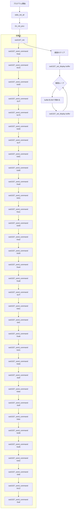

https://cdn.sparkfun.com/assets/1/a/5/d/4/DS-15890-Zio_OLED.pdf

```mermaid
graph TD
    A[プログラム開始] --> B[stdio_init_all]
    B --> C[i2c_init_pico]
    C --> D[ssd1327_init]
    D --> E[画面のクリア]
    E --> F[ssd1327_set_display buffer]
    F --> G{無限ループ}
    G --> H[bufferを255で埋める]
    H --> I[ssd1327_set_display buffer]
    I --> G

    subgraph 初期化
        D1[ssd1327_send_command 0xae]
        D2[ssd1327_send_command 0x15]
        D3[ssd1327_send_command 0x00]
        D4[ssd1327_send_command 0x7f]
        D5[ssd1327_send_command 0x75]
        D6[ssd1327_send_command 0x00]
        D7[ssd1327_send_command 0x7f]
        D8[ssd1327_send_command 0x81]
        D9[ssd1327_send_command 0x80]
        D10[ssd1327_send_command 0xa0]
        D11[ssd1327_send_command 0x51]
        D12[ssd1327_send_command 0xa1]
        D13[ssd1327_send_command 0x00]
        D14[ssd1327_send_command 0xa2]
        D15[ssd1327_send_command 0x00]
        D16[ssd1327_send_command 0xa4]
        D17[ssd1327_send_command 0xa8]
        D18[ssd1327_send_command 0x7f]
        D19[ssd1327_send_command 0xb1]
        D20[ssd1327_send_command 0xf1]
        D21[ssd1327_send_command 0xab]
        D22[ssd1327_send_command 0x01]
        D23[ssd1327_send_command 0xb6]
        D24[ssd1327_send_command 0x0f]
        D25[ssd1327_send_command 0xbe]
        D26[ssd1327_send_command 0x0f]
        D27[ssd1327_send_command 0xbc]
        D28[ssd1327_send_command 0x08]
        D29[ssd1327_send_command 0xd5]
        D30[ssd1327_send_command 0x62]
        D31[ssd1327_send_command 0xfd]
        D32[ssd1327_send_command 0x12]
        D33[ssd1327_send_command 0xaf]
        D --> D1 --> D2 --> D3 --> D4 --> D5 --> D6 --> D7 --> D8 --> D9 --> D10 --> D11 --> D12 --> D13 --> D14 --> D15 --> D16 --> D17 --> D18 --> D19 --> D20 --> D21 --> D22 --> D23 --> D24 --> D25 --> D26 --> D27 --> D28 --> D29 --> D30 --> D31 --> D32 --> D33
    end
```