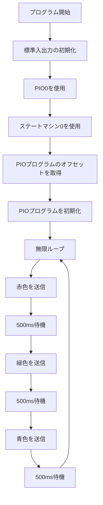

```mermaid
flowchart TD
    A[プログラム開始] --> B[標準入出力の初期化]
    B --> C[PIO0を使用]
    C --> D[ステートマシン0を使用]
    D --> E[PIOプログラムのオフセットを取得]
    E --> F[PIOプログラムを初期化]
    F --> G[無限ループ開始]
    G --> H[赤色を送信]
    H --> I[500ms待機]
    I --> J[緑色を送信]
    J --> K[500ms待機]
    K --> L[青色を送信]
    L --> M[500ms待機]
    M --> G[無限ループ]
```