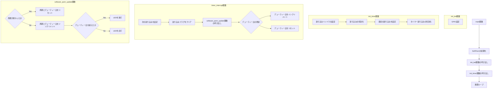

```mermaid
graph TD
    A[main関数] --> B[SoftPwmの初期化]
    B --> C[init_led関数の呼び出し]
    C --> D[init_timer関数の呼び出し]
    D --> E[無限ループ]

    subgraph init_led関数
        F[GPIO設定]
    end

    subgraph init_timer関数
        G[割り込みハンドラの設定]
        G --> H[割り込みの有効化]
        H --> I[最初の割り込みを設定]
        I --> J[タイマー割り込みの有効化]
    end

    subgraph timer_interrupt関数
        K[次の割り込みを設定]
        K --> L[割り込みフラグをクリア]
        L --> M[software_pwm_update関数の呼び出し]
        M --> N{デューティー比の更新}
        N --> O[デューティー比をインクリメント]
        N --> P[デューティー比をリセット]
    end

    subgraph software_pwm_update関数
        Q{周期が終わったか}
        Q -->|Yes| R[周期とデューティー比をリセット]
        Q -->|No| S[周期とデューティー比をインクリメント]
        S --> T{デューティー比を超えたか}
        T -->|Yes| U[LEDを消灯]
        T -->|No| V[LEDを点灯]
    end
```