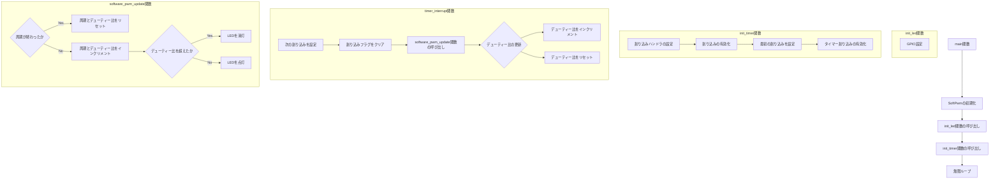

# 概要

マイコンのタイマー割り込み機能を使用して、接続されたLEDの明るさを制御するC言語プログラム。

# 動作
## 初期化

1. init_led()関数で、LEDを接続したGPIOピンを出力モードに設定し、消灯状態にする。
2. init_timer()関数で、タイマー0の割り込みを設定し、最初の割り込みが発生するまでの時間を設定する。

## 割り込み処理

1. タイマー0の割り込みが発生すると、timer_interrupt()関数が実行される。
2. software_pwm_update()関数を呼び出し、ソフトウェアPWMのデューティー比を更新し、LEDの出力を制御する。
3. timer_interrupt()関数は、次の割り込みが発生するまでの時間を設定する。

## PWM制御

1. software_pwm_update()関数は、SoftPwm構造体の情報に基づいて、GPIOピンのHIGH/LOW状態を切り替える。
2. SoftPwm.cycle_periodがPWMの周期、SoftPwm.duty_periodがHIGHレベルの期間を表す。
3. main()関数で、SoftPwm.cycle_periodを200に設定し、SoftPwm.duty_periodを0に初期化する。これにより、PWM周期は20msとなる。

## メインループ

1. main()関数は、無限ループに入り、割り込みが発生するのを待つ。 PWM制御は割り込み処理によって行われるため、メインループでは特に処理を行わない。

# 補足

* PWMの周期は、SoftPwm.cycle_periodとタイマー割り込みの間隔によって決定される。このプログラムでは、20msに設定している。
* LEDの明るさは、SoftPwm.duty_periodの値を変更することで調整できる。
* PWMの周期を20msに設定しているとサーボモータも制御できる。

# フローチャート
